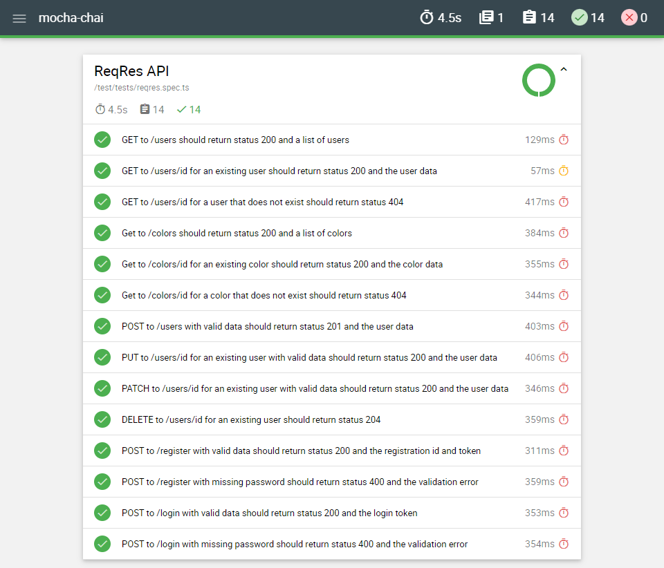
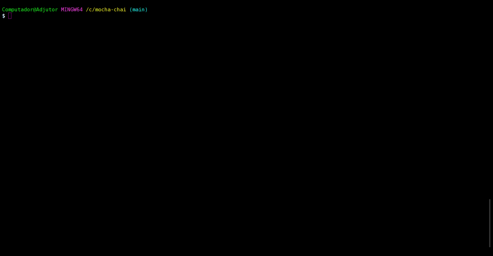

# Mocha Chai

A sample API test automation project in [TypeScript](https://www.typescriptlang.org/), using [Mocha](https://mochajs.org/), [Chai](https://www.chaijs.com/), [Axios](https://axios-http.com/docs/intro), and [Mochawesome](https://github.com/adamgruber/mochawesome#readme).

## ReqRes

The API chosen for testing was ReqRes. It simulates how a real application behaves, is highly available and accessible from anywhere. For more information, visit their website [here](https://reqres.in/).

## How it works

The project uses Mocha as the test framework, Chai as the assertion library, Axios as the HTTP client to perform API requests, and Mochawesome to generate HTML reports.  
A workflow is set up to install Node.js, install the required packages, run the tests, and publish the HTML report to GitHub Pages. The report can be viewed [here](https://kafziel4.github.io/mocha-chai-api-tests/).

## How to run it

- Install [Node.js](https://nodejs.org/en/)
- Install the project packages: `npm install`
- Run the tests: `npm test`

